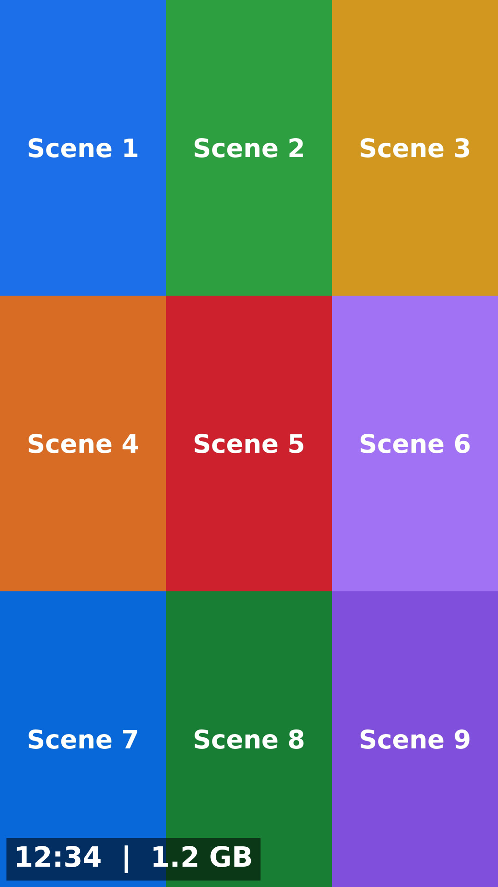

# Feature Enhance — a Jellyfin plugin

Four things the stock web client cannot do:

1. **Search = four category tiles, then Jellyfin's own list page** — a broad query no longer renders ~900 cards at
   once; clicking a tile opens the native list page with its real paging, its own sort menu and filters.
2. **Search by file path / folder name** — type a folder name and find everything inside it, typos included; folder
   results can play or shuffle the files inside them.
3. **3×3 contact sheet preview** — the small eye button on video cards opens a nine-frame summary of the whole video.
4. **Flicker-free navigation** — going back or up a level cross-fades instead of flashing an empty page.



Requires **Jellyfin 12.0.x** (targetAbi `12.0.0.0`).

Unlike plugins that rewrite `index.html` on disk, this one injects its client scripts **at request time** and keeps
everything under `config/data/plugins/`, so container rebuilds and Jellyfin upgrades do not break it.

---

## Features

### 1. Search = four category tiles, then the **native** list page

Jellyfin's search page has **no pagination at all**: one `/Items?...&limit=800` request comes back and every single
card is built at once, into one horizontally-scrolling strip per type. Measured on a 145k-item library, a search for
`20` rendered **920 cards** and burned seconds of main-thread time — on a phone it simply locked up.

Now a search renders **no cards at all**, only four tiles:

```
搜索「2026」· 共 13,672 条结果
┌──────────┬──────────┬──────────┬──────────┐
│  视频     │  图片     │  相册     │  文件夹   │
│  11,549   │  2,121   │  1       │  1       │
└──────────┴──────────┴──────────┴──────────┘
```

- the four tiles come from **one** call that returns a count per category together with the matching mode that
  produced it; every group is counted with exactly the query the list page will run, so the tile number and the list
  total are the same number
- **the stock search requests are never sent.** They used to be fired and then hidden — 800 items fetched,
  ~100 KB–1 MB transferred, ~900 cards built, all thrown away. A bootstrap script injected **before** the app's
  bundles (the client captures `window.fetch` and drives `XMLHttpRequest` through axios, so it has to be that early)
  answers every `/Items?…&searchTerm=…` (and `/Artists`, `/Persons`, `/Studios`) call with an empty 200 locally.
  Measured in a real browser: **6 native requests intercepted, 0 requests with `searchTerm` leaving the browser**
- the short-circuit is **permanent** — there is no fallback to the native search UI. If the plugin's own API cannot
  be reached the tiles are simply drawn with **0** and a retry link; the page is never handed back to the stock
  search. One consequence worth knowing: if the injected script itself fails to load, the search page stays empty
  until the browser is refreshed (a hard refresh fixes it)
- one search costs **one** request to the plugin's own API (`/FeatureEnhance/Search/Counts`), and that result is
  cached per term for 5 minutes — returning to the search page from a list or detail page renders instantly with
  **zero requests**
- **search is fuzzy in every category** (videos, images, albums, folders). Each group is resolved in order
  *name → path → fuzzy*; fuzzy is an **approximate-substring** match (edit distance over a sliding window, so
  `bulll` finds "Bull Video …" but *doesn't* drag in random long names the way plain subsequence matching did).
  Because the fuzzy result set is scored and ordered deterministically, its size *is* the total and paging works
- clicking a tile opens Jellyfin's **own list page** (`#/list?type=…`): the native grid, the native pager,
  *sort by name / date added / rating / runtime …*, the native **filter** menu, play-all/shuffle — all stock UI
- the stock search area *and its loading spinner* are hidden synchronously on the route change (a body class, so it
  never paints), including the case where a native query stays pending forever

The list page is bridged, because its own data path cannot paginate a search: the server routes any `searchTerm`
through its search *providers* and **caps `TotalRecordCount` at `limit × 3`** (a `limit=100` list reports
"300 of 1-100" and stops). The plugin wraps the client's `ApiClient.getItems` so that, while you are on that list:

- the page you asked for is fetched from the plugin's endpoint (database `COUNT` + `Skip/Take`), giving the **real
  total** (the example above shows "11 549 的 1-100", not 300) and working deep paging
- the ids of that page are then re-fetched through the native endpoint, so the cards are the stock ones
- **the native sort menu and filter menu are applied server-side through Jellyfin's own `TranslateQuery` /
  `ApplyOrder`** — resolution (4K / HD / SD), 3D, subtitles, trailers, theme songs, special features, video types,
  tags, genres, the alphabet picker, played / unplayed / favourite / resumable, and every `ItemSortBy` key the menu
  offers. Picking "runtime" or "4K" really changes the list instead of only changing the button
- the search context (term + matching mode) travels **in the URL** (`&feTerm=…&feMatch=…`), so a reload, a second
  tab or a long-idle list page still resolves to the search it came from
- browsing a normal folder (`#/list?parentId=…`) is untouched — the bridge only engages for a list opened from a
  search tile

**Folder results can play.** The native play / shuffle / queue buttons on that list fetch items through the same
`getItems` call, which would hand folders to the player — nothing plays. The plugin detects the click and asks its
own endpoint for the **playable items inside those folders** instead (same matching mode, same access rules, same
native filters), then hands them to Jellyfin's own playback manager: shuffle gives a randomised 300-item slice, play
all follows the current sort.

### 2. Search by path and folder name

- matches **file paths and folder names**, not only item titles — both in the plugin's own endpoints and in the
  native search box (through `IInternalSearchProvider`, priority 200)
- **fuzzy matching** for folder names (edit distance + approximate-substring scoring): `网凰` finds `网黄`
- single-character terms work (e.g. one CJK character)
- **folders are searchable at all** — Jellyfin's own search hard-codes `Folder`/`CollectionFolder` out of its
  result types, which is why the "文件夹" tile is the plugin's own
- access control follows the server, not the client: the user identity comes from the authentication ticket (never
  from a query parameter) and every query goes through Jellyfin's own access filter, so library access, parental
  rating and blocked tags all apply

### 3. Video preview grid (the eye button)

- **nine frames sampled at 10%, 20% … 90%** of the runtime — the whole video, not a few adjacent seconds
- every cell is a **complete frame**: no cropping and no letterboxing. The cell aspect follows the video itself —
  portrait frames stay upright, **landscape frames are rotated 90° inside their cell** so they fill a portrait cell
  exactly. The sheet is always portrait and the client never rotates it, so **one cache file per video**
- rotation is decided from the **actual ffmpeg input arguments**: the native hardware path passes
  `-noautorotate` / `-display_rotation 0` (frames arrive in storage orientation), the software path lets ffmpeg
  auto-rotate (frames arrive display-oriented). Both produce the same sheet
- duration and file size are burned into the bottom-left corner (`1:56:53  |  4.8 GB`)
- **icon-only states** (no text): bouncing dots while generating → spinning icon while retrying →
  a crossed-out-eye badge when a preview is impossible (the stock thumbnail is shown behind it)
- **hardware acceleration is Jellyfin's own**: the plugin builds the same `EncodingJobInfo` /
  `BaseEncodingJobOptions` the built-in trickplay generator uses and asks `EncodingHelper` for the ffmpeg
  arguments — device setup, decoder choice, tonemapping and GPU↔memory transfers all follow
  *Dashboard → Playback → Transcoding*. There is no hard-coded `-hwaccel` anywhere in this plugin
- the sampler seeks nine short windows instead of walking the file, and each cell runs as its own ffmpeg process
  (a stuck or unreadable cell cannot hang the request); the darkness check for all nine cells is one extra process
- a single dark cell (scene cut / black frame) is re-sampled **1 % later** — the sheet is never regenerated
  wholesale, so all-black videos cannot cause repeated work

Measured on an Intel iGPU (QSV → VAAPI), cold cache:

| source | time | sheet |
|---|---|---|
| 1080p, 116 min | 1.2 s | 1080×1920 |
| 4K 3840×2160, 116 min | 1.4 s | 1080×1920 |
| portrait 720×1280 | 0.3 s | 1080×1920 |
| cached (per video) | ~10 ms | `ETag` + `304` on revalidation |

Hardware decoding vs software on the same files: **2.95 s vs 8.44 s** total, **5.7 s vs 17.1 s** CPU time.

### 4. Flicker-free back navigation

Frame-by-frame video analysis (20 fps) showed what actually happens when you open an item or go back: React tears the
page down, and for **2–3 frames (100–150 ms) the entire content area is empty** — then the cards reappear and paint
their images one by one. That is the "flicker, as if the elements were re-rendered".

- on every route change the outgoing page is snapshotted (`cloneNode`, ~3 ms for 2 200 nodes) into a fixed overlay,
  so the new page renders **behind** it and is only revealed when it actually has content
- the overlay then cross-fades out (200 ms), which also hides the "cards exist but images are not painted yet" frames
- scroll offsets (page **and** horizontal rows) are copied into the snapshot, so it looks identical
- the overlay sits **below** the app bar and is dropped instantly on any wheel / touch / key input
- scroll restoration is re-applied every frame for the first ~900 ms (the client re-clamps the scroll position after
  the page is shown) and stops the moment you scroll yourself; `history.scrollRestoration` is set to `manual` so
  the browser's own restore cannot fight it
- the image fade-in animation and the blurhash placeholder are disabled — both were visible flashes on their own
- **the theme's own entrance animation is switched off.** Abyss puts a staggered `abyss-section-fade-up` (0.7 s,
  delays 0.05–0.45 s) on every `.verticalSection`, so every navigation replays it: measured on a phone, all 13 home
  sections sat at **opacity 0 for ~450 ms** and then faded in for another 0.7 s. With the plugin's override they are
  at opacity 1 from the first frame (40/60 samples with hidden sections → 0/60)
- **sticky `:hover` on touch is cleaned up.** On mobile Chrome a tapped element keeps matching `:hover` even after
  you tap somewhere else, so that button stayed highlighted. The plugin neutralises the hover background for
  transparent button variants and, on every route change, clears the stuck hover by re-inserting the affected node
  (the only technique that actually clears it; `pointer-events`, `blur()`, `display`/`visibility` toggles do not)

### 5. (removed) Spotlight gestures

The home hero ("Spotlight") used to be covered by a touch layer that this plugin injected. It was removed on
2026-09-15 at the user's request: the hero is an iframe that cannot be made to behave like part of the page (vertical
gestures get swallowed, horizontal ones fight the home page's own tab swipe), and no amount of patching made the
swipe transition feel right. The hero itself is now switched off at the theme level (`ABYSS_SPOTLIGHT=0` in the
container environment, which makes the theme's own hook strip the loader tag and the three files from `web/ui/`),
and the plugin no longer ships any spotlight script.

---

## Install

1. **Dashboard → Plugins → Repositories → +** and add:

   ```
   https://cdn.jsdelivr.net/gh/duanzequn/jellyfin-plugin-pathsearch@main/manifest.json
   ```

   (`https://raw.githubusercontent.com/duanzequn/jellyfin-plugin-pathsearch/main/manifest.json` works too.)

2. **Dashboard → Plugins → Catalog → Feature Enhance → Install**, then restart Jellyfin.

---

## Notes and limitations

- **Jellyfin 12 only.** On another major version the plugin has to be rebuilt against that ABI.
- The native search UI is **permanently** short-circuited, by design. Uninstalling (or disabling) the plugin is the
  only way to get it back.
- Items the library has **not analyzed yet** (no media streams stored) are **probed on demand**, so the first
  preview of such a video takes a moment longer; the probe result is cached in memory for 30 minutes.
- **Broken files** (missing `moov`, truncated download) cannot be previewed. The card shows the “unavailable” badge
  and falls back to the stock thumbnail — that is not a plugin failure.
- The JPEG **encoder** runs on the CPU (`mjpeg`): that is the same code path trickplay uses when hardware JPEG
  encoding is disabled, and it is needed because the composition works on system-memory frames.
  **Decoding is hardware accelerated.**
- Sheets are cached under `config/data/plugins/Jellyfin.Plugin.FeatureEnhance/grid/` (≈100–400 KB per video). The
  cache is trimmed automatically when it grows past 4 000 files or 4 GB (oldest first); delete the folder to start
  over — files are regenerated on demand.

---

## Build from source

Requires the **.NET 10 SDK**.

```bash
git clone https://github.com/duanzequn/jellyfin-plugin-pathsearch.git
cd jellyfin-plugin-pathsearch
./build.sh            # -> dist/Jellyfin.Plugin.FeatureEnhance_<version>.zip + checksum
```

Install manually by copying the DLL into `<config>/data/plugins/FeatureEnhance_<version>/` and restarting Jellyfin.

## Repository layout

```
jf-featureenhance/Jellyfin.Plugin.FeatureEnhance/   plugin source (C#)
client-scripts/                             the only source of the client JS (embedded into the DLL at build time)
manifest.json                               Jellyfin plugin repository manifest
build.sh                                    build + package + print the manifest entry
scripts/update_manifest.py                  writes version/checksum/url/timestamp into manifest.json
scripts/render-icon.mjs                     renders docs/icon.svg -> docs/icon.png (512x512 square plugin icon)
docs/icon.svg / docs/icon.png               the plugin icon: full-bleed square, no baked-in rounded corners
docs/DEVELOPMENT.md                         implementation notes, measurements and the pitfalls hit along the way
```

---

## 中文说明

**功能**：给 Jellyfin 客户端补上四件事（全部在请求时注入，容器里的文件一个都不改）：

①**搜索 = 四个分类方格 + 原生列表页（真分页 + 真排序 + 真筛选）** —— 原生搜索**没有分页**：一个 `limit=800` 的请求回来就把
900 多张卡片一次性建出来，还是横向滚动条。现在搜索**一张卡片都不渲染**，只显示四个方格：
**视频 / 图片 / 相册 / 文件夹**，每格是各自的**真实总数**（数据库 COUNT，且与列表页完全同一口径）。
点任意一格 → 进 Jellyfin **自己的列表页**（`#/list?type=…`）：原生网格、原生分页器、排序菜单、筛选菜单、全部播放全是原生的；
列表页数据由插件桥接，所以分页器显示「11,549 的 1-100」而不是被卡死的 300。**排序和筛选是真生效的**：
服务端用 Jellyfin 自己的 `TranslateQuery`/`ApplyOrder` 翻译（4K/HD/SD、3D、字幕、预告片、主题曲、花絮、
视频类型、标签、类型、字母选择器、已看/未看/收藏/继续观看，以及排序菜单里的每个 `ItemSortBy`）。

**原生那几条搜索请求永远不发**（以前只是把渲染结果藏起来：800 条照拉、约 100KB~1MB 照传、900 张卡片照建）。
插件在 app 的 bundle **之前**注入了一小段引导脚本（客户端把 `window.fetch` 抓走了、搜索走的是 axios 的 XHR，
所以必须这么早），凡是 `/Items?…&searchTerm=…`（以及 `/Artists`/`/Persons`/`/Studios`）请求都在本地直接回一个
空的 200 —— 实测浏览器端 **6 个原生请求被拦截、带 searchTerm 的请求 0 个**。
这个短路是**永久的**：不提供任何"退回原生搜索"的入口，接口取不到数就把四个格子画成 **0** 加一个重试，
页面绝不交回原生（代价：万一注入脚本本身没加载成功，搜索页会是空的，强刷一次即可）。
一次搜索只花**一个**请求（计数接口），并且按搜索词缓存 5 分钟 —— 从列表页/详情页返回时**零请求**。

**「文件夹」格子可以直接播**：原生列表页的播放/随机播放/加入队列同样走 `getItems`，拿到的是文件夹、播放器放不了；
插件识别到这次点击后，改从插件接口取**这些文件夹内部的可播放条目**（同一套匹配口径、同样的权限与原生筛选），
再交给 Jellyfin 自己的播放器：随机播放是打乱的 300 条，播放全部按当前排序。

②**按文件路径/文件夹名搜索** —— 原生搜索只匹配条目名，而且**硬编码把文件夹排除**（所以「文件夹」格子只能是插件自己做）；
插件把 Path 纳入匹配（原生搜索框里也生效，通过 `IInternalSearchProvider`），支持模糊匹配（`网凰`→`网黄`）与单字搜索。
权限一律跟着服务端走：用户身份只取自认证票据（绝不来自查询参数），查询全部走 Jellyfin 自己的访问过滤，
库访问、分级限制、屏蔽标签都生效。

③**页面切换不闪** —— 三条一起做：

- **冻结帧**：逐帧录屏实测，点开条目 / 返回上一级时内容区会**整页空白 2~3 帧（100~150ms）**，然后卡片再逐张补图。
  现在路由一变先给当前页拍一张冻结帧挂到上层，新页面在背后渲染好再 200ms 交叉淡出 —— 实测空白帧 **3 帧 → 0 帧**；
- **关掉主题的入场动画**：Abyss 给每个 `.verticalSection` 都挂了 `abyss-section-fade-up`（0.7s，错峰 0.05~0.45s），
  **每次切页都会整体重放** —— 手机上实测所有分区有 **450ms 停在 opacity 0** 再淡入，整页（连图片带按钮）都在闪。
  插件里覆盖掉之后：分区从第一帧就是 opacity 1（"有隐藏分区"的采样 **40/60 → 0/60**）；
- **清理触屏"粘住"的 `:hover`**：移动端点过的元素之后一直 `matches(':hover')` 为真（`pointer-events` 开关、
  `blur()`、display/visibility 都清不掉，只有"摘下来再放回原位"能清），那个按钮就永远是高亮色 ——
  现在切页时主动清理，并且把透明按钮的 hover 背景还原。滚动位置恢复由 smooth.js 一处负责（连续 12 帧校正、
  用户一动就停），并设了 `history.scrollRestoration='manual'` 避免和浏览器抢。

④**视频卡片左上角小眼睛 → 3×3 宫格预览** —— 取样点是片长的 10%…90%，每格都是完整画面
（横屏素材在格内旋转 90°，不裁切不加黑边；旋转方向按**实际 ffmpeg 参数**判断：硬解路径带 `-noautorotate`，
软解路径由 ffmpeg 自动旋转，两条路结果一致），左下角烧入片长和文件大小，**硬件加速完全走 Jellyfin 自己的逻辑**
（问 `EncodingHelper` 要参数，跟随「播放 → 转码」里的设置），生成中/重试中/不可用三种状态只用图标不用文字。

⑤（已移除）**首页大图区 Spotlight** —— 2026-09-15 按用户要求直接关掉了：它是主题塞进来的 iframe，
纵向手势会被吃掉、横向又和首页 tab 的滑动打架，怎么补都不顺。现在在容器环境里设 `ABYSS_SPOTLIGHT=0`，
主题自己的钩子会把 index.html 里的 loader 标签和 `web/ui/` 下三个文件清干净，插件也不再带任何 spotlight 脚本。

**安装**：仪表盘 → 插件 → 存储库 → 添加
`https://cdn.jsdelivr.net/gh/duanzequn/jellyfin-plugin-pathsearch@main/manifest.json`，然后在「目录」里安装 **Feature Enhance** 并重启。

**要求**：Jellyfin **12.0.x**。所有文件都在 `config/data/plugins/` 里，不改容器内任何文件，升级不受影响。

**2.1.0.0**：搜索页彻底改为"四个分类方格 + 原生列表页"（真分页/真排序/真筛选）、原生搜索请求永久短路、
「文件夹」格子可直接播放文件夹内的文件、宫格预览的输入参数与旋转判定修正、插件图标与说明更新。
**2.0.0.0**：插件由 `Path Search` 更名为 `Feature Enhance`（命名空间、路由、部署目录一起改），
**GUID 不变**，所以在仪表盘里是同"一个插件"在升级；宫格缓存目录
`config/data/plugins/Jellyfin.Plugin.FeatureEnhance/grid/` 也已从旧目录迁移过来。检索
`PathSearch`/`FeatureEnhance` 在容器 web 目录里都是 0 次命中。

---

## License

MIT — see [LICENSE](LICENSE).
